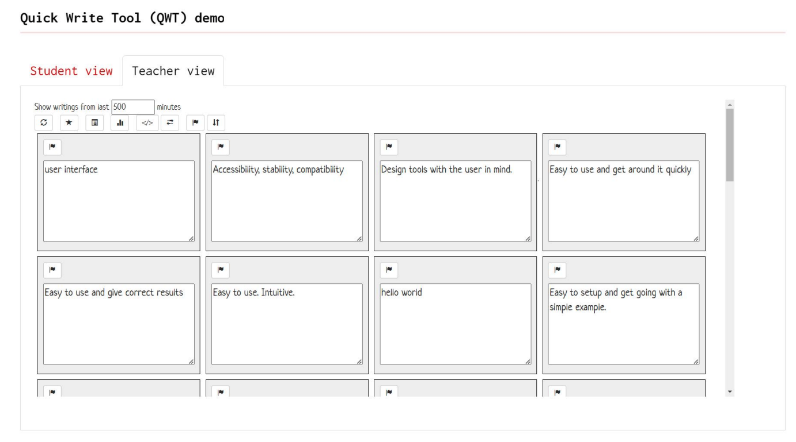
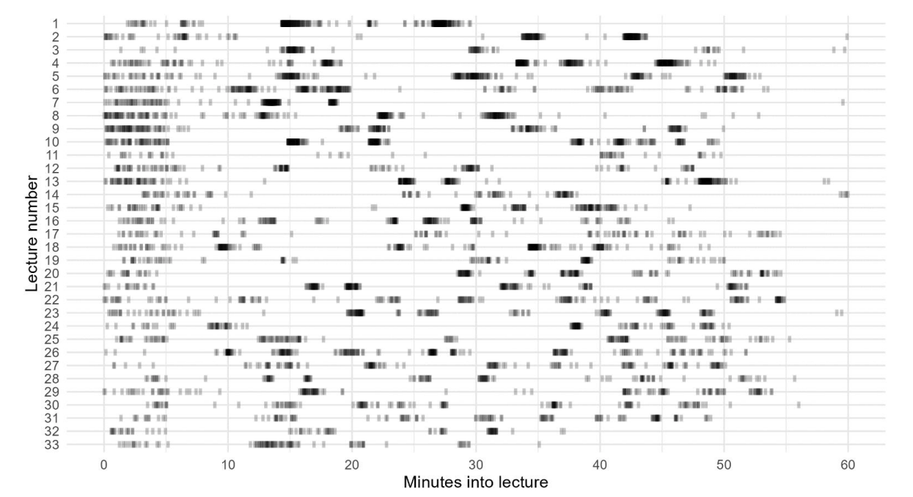
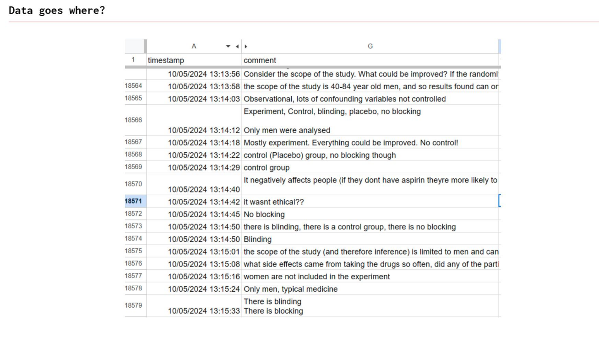
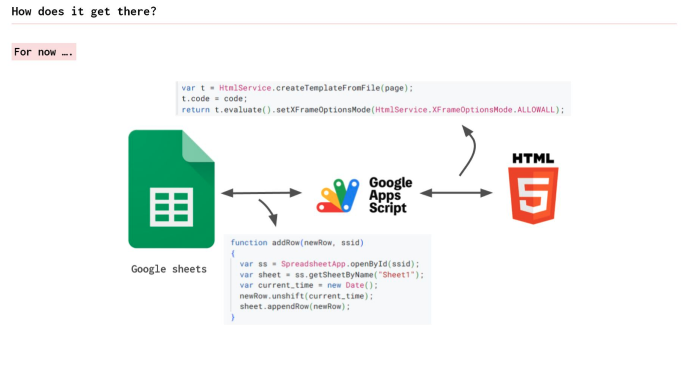

## Hi! 👋

::: {.columns}
::: {.column width="50%"}
::: {style="text-align: center;"}
{fig-alt="Fonti Kar" style="width: 220px; aspect-ratio: 1; object-fit: cover; border-radius: 50%;"}
:::

* I'm [@fontikar](https://github.com/fontikar)
* CDPAE (mostly) at Caufield
* Biodiversity data wrangler 
* Lover of open source tools

:::

::: {.column width="50%"}
::: {style="text-align: center;"}
{fig-alt="Michael Lydeamore" style="width: 220px; aspect-ratio: 1; object-fit: cover; border-radius: 50%;"}
:::

* I'm [@MikeLydeamore](https://github.com/MikeLydeamore)
* Chief vibes officer
* `ggplot2battles`
:::
:::

## A classroom anecdote 

::: {.columns}
::: {.column width="55%"}

You walk into your class and think to yourself: 

- "Goodness, am I getting older?" 😯
- "How am I going to compete their whatever is on their phone?" 😬
- "What does yeet/sigma/aura mean?" 😵‍💫
- "Yikes, how can I engage and build a connection with my students?" 😩
:::

::: {.column width="45%"}
::: {.fragment .custom-callout-box}
{fig-alt="Dead Poets Society classroom scene" width="100%"}
What solutions do we have as educators??
:::
:::
:::

## A development anecdote

In `VSCode-R`, you can run custom commands using your highlighted text, very helpful for say `tar_load()` or `head()`.

In Positron, this is not an option, although the developers were receptive when I suggested it. So, I decided I would add it myself.

::: {.columns}
::: {.column width='50%'}
::: {.fragment}
1. Clone the repo
2. Install the dependencies
3. Run the dev task
4. ????
5. App crashes on launch
:::
:::
::: {.column width='50%'}
::: {.fragment .custom-callout-box}
This is exactly the fear students feel in our classes.
:::

:::
:::

## Our inspo ✨

At WOMBAT 2024, Anna Ferguson showed off the "Quick Write Tool"

{fig-align="center"}

## Our inspo ✨

And it seems to work

{fig-align="center"}

## Data is stored in a GSheet

{fig-align="center"}

## For now (but still)

{fig-align="center"}

## Write-Now

Anna has released this tool openly (at ICOTS a few weeks ago)

::: {style="text-align: center"}
<https://write-now.online/>
:::

You can self host this using the linked repo and a Google Sheet.

## Ed-ie

::: {.columns}
::: {.column width='50%'}

<https://www.ed-ie.com>

:::

::: {.column width='50%'}
::: {.fragment style="text-align: center;"}
{fig-alt="WALL-E" style="width: 260px; aspect-ratio: 1; object-fit: cover; border-radius: 50%;"}
:::
:::
:::

## Ed-ie features as educators 🍎

::: {.incremental}
* Submit a prompt: 💬
  * A pre-flight check
  * A formative assessment
  * A invite for questions/feedback
* Pace the classroom ⏱️
* Review responses before sharing widely 👷
* Generate discussion and connection by sharing responses
:::

## Edie-features as learners 🐛

::: {.columns}
::: {.column width='50%'}
::: {.incremental}
* Engage ✨anonymously✨
* Multi-modal reply:
  * Text (emojis welcome!)
  * Draw (Tactile, visual learners)
  * GIPHY
* Upvote each others questions
:::

::: {.column width="45%"}
{fig-alt="Drake dancing in a music video" width="100%"}
:::
:::
:::

## Ed-ie structure

::: {.incremental}
* Ed-ie consists of a set of _spaces_
* Each space consists of a set of _sessions_
* Each session has a unique set of data associated with it
:::

::: {.fragment}
The host page lets you log into a space, and manage your sessions.
:::

::: {.fragment}
* Participants join a space + session using the join page, or the QR code on the host page
:::

## Behind the scenes

::: {.columns}
::: {.column width='50%'}
Each comment is inserted into a SQL database

* `uuid`
* `session_code`
* text, gif_data, drawing_data
* status, starred, flagged
* name
:::
::: {.column width='50%'}
::: {.fragment}
Separate tables for:

* Votes
* Group questions
* Question banks
* Prompt history
* Spaces & sessions

:::

:::
:::

## Why not a Google Sheet?

* Tied to an account
* Not quite as good of data-type protection for long term storage
* Concurrency restrictions can make large classes perform poorly
* Lookups fall apart after about 10,000 rows

::: {.fragment}
The database is more _scalable_ but a bit less "free"
:::

## Behind the scenes

Deployment managed by Vercel, fully automated on every push to repo

Connections to database and admin passwords handled by environment variables

Generous free tier (so far)
